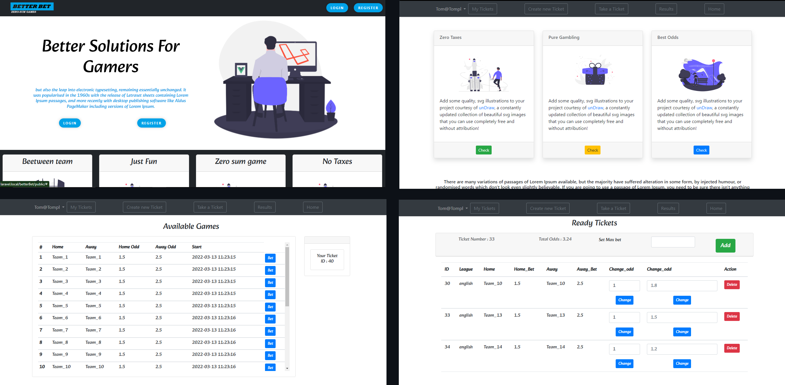
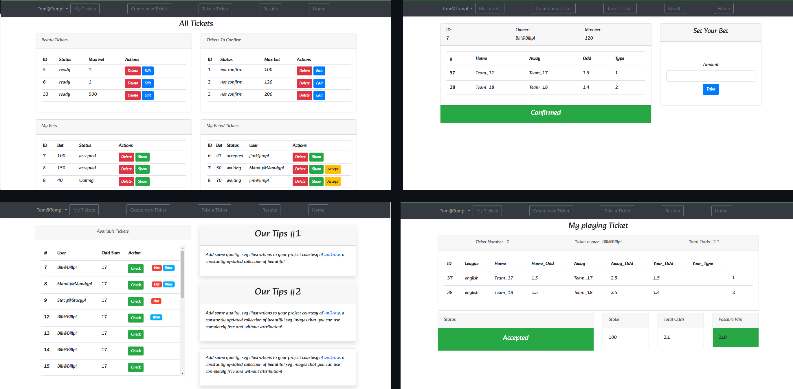
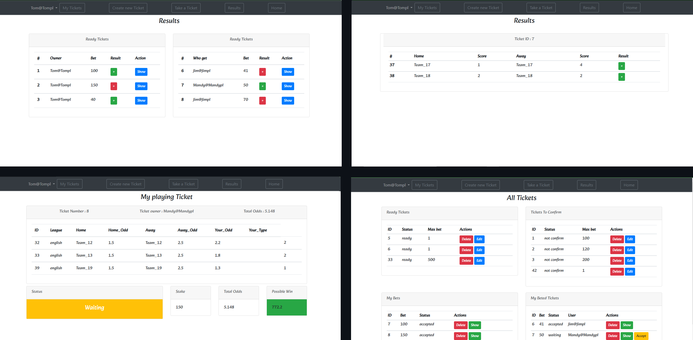

# Application for betting games in private groups. A zero-sum game, with no taxes or margins.

Do you like to play a ticket at the bookmaker sometimes? Increase the excitement for the event you are watching. But the bet tax and the bookmaker's start profit by odds
gives you the impression that the bet is unfavorable?  Use BetterBet.

</img>

## Rules

An application that enables games between users.
Users create their own coupons that can contain many matches, in addition, they set the rate themselves.
Other users can take them and the competition begins. No markup, no taxes

</img>

## Details 

Matches with all the necessary information, such as odds from real bookmakers, are downloaded from an external API.
The user has the option to add multiple matches per coupon, along with their own type, odds and maximum stake to accept.
Then he can approve it. Then other users can play on it.

</img>

## Details 

Final approval by the author is required for the voucher to be accepted.
The results of the matches are also downloaded periodically through the API.
After all matches on the coupon are completed, notifications are sent to participating players.
The whole game after logging in in closed groups.

### How to use

- Clone the repository with __git clone__
- Copy __.env.example__ file to __.env__ and edit database credentials there
- Run __composer install__
- Run __php artisan key:generate__
- Run __php artisan migrate__
- Run __php artisan db:seed --class=BetterSeeder__  or use ready database file
- That's it
- Name of user is also his password
---